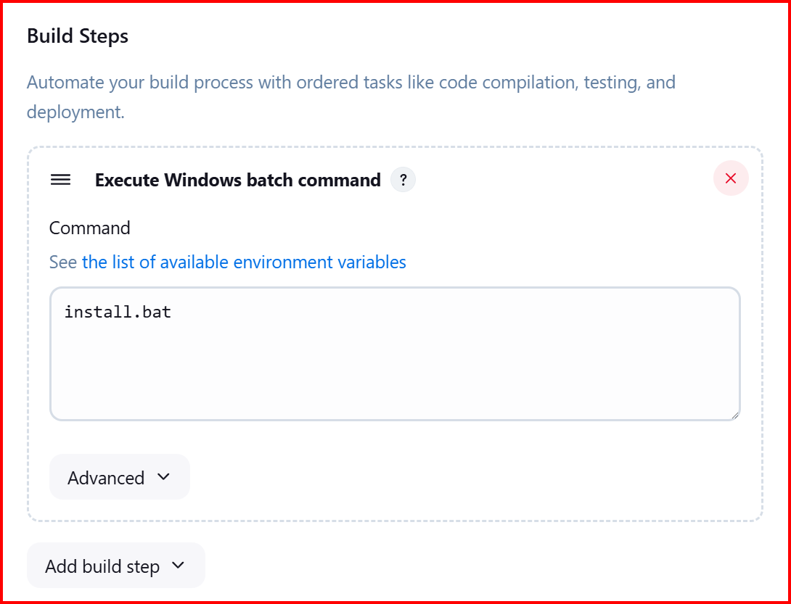

# Form-Wizard
A project developed to test automation scenarios on the DemoQA Practice Form page. 
This project automates the process of form filling and validation, analyzes test results, 
and runs seamlessly in a continuous integration/delivery (CI/CD) environment with Jenkins integration.

## Installation

### Prerequisites

- Python 3.13
- pip (Python package installer)
- Jenkins (for continuous integration)
### Steps

1. **Clone the Repository**

Windows Users Only

   ```bash
   git clone https://github.com/Catch-XXII/form-wizard.git
   cd form-wizard
   python -m virtualenv venv
   \.venv\Scripts\activate.bat
   pip install -r requirements.txt
   ```
   
2. **Configuration**

   Configure your project-specific settings in the `pytest.ini` and other configuration files as needed.

## Usage

To run the tests using Pytest, navigate to the project directory and execute the following command:

```bash
pytest
```

## Running Tests in Jenkins

For continuous integration, you can configure Jenkins to run your tests. 
Ensure that Jenkins is correctly configured to use the necessary 
Python environment and has access to the required dependencies.
See media folder for more details about cron jobs

Every Hour Cron Job 

H 0 * * *

Go to Jenkins > Your Job > Configure.

Under the Build Triggers section, enable Build periodically.

Enter the cron expression (H 0 * * *).

Save your changes.

## Project Structure

A brief overview of the project structure:

- **`requirements.txt`**: List of dependencies.
- **`install.bat`**: Batch file for setting up Jenkins or other environments.
- **`pytest.ini`**: Configuration settings for Pytest.
- **`tests/`**: Directory containing test cases.


## Jenkins Settings
1. **Workspace view**


2. **Trigger for every 5 minutes**


3. **Successful Build Results Screenshot**


4. **Build Steps Configuration with install.bat**



